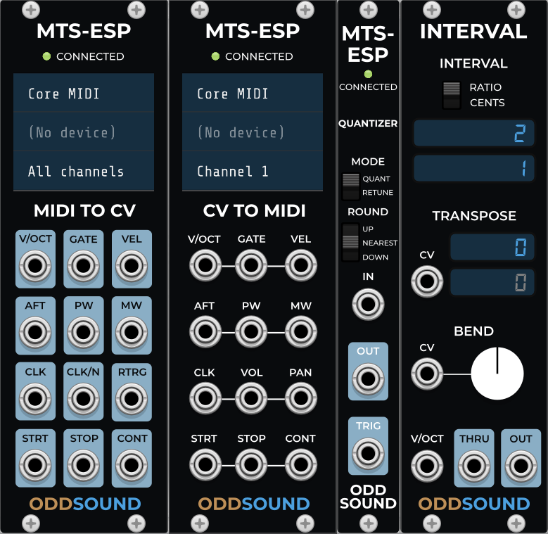

# MTS-ESP VCVRack Pug-in

A collection of modules for using MTS-ESP for microtuning in [VCV Rack](https://github.com/VCVRack/Rack) virtual module synthesizer.

To load an MTS-ESP master plugin in VCVRack, such as ODDSound [MTS-ESP Master](https://oddsound.com/mtsespsuite.php) or [MTS-ESP Mini](https://oddsound.com/mtsespmini.php), you will need [VCV Host](https://vcvrack.com/Host).  Alternatively load an MTS-ESP master plug-in into a DAW running on the same computer, since MTS-ESP supports IPC.

## MTS-ESP MIDI To CV

A version of the VCV Rack core MIDI-CV module with MTS-ESP Client support added.  Pitch CV output will follow the tuning from an MTS-ESP master plug-in, if loaded.

## MTS-ESP CV To MIDI

A version of the VCV Rack core CV-MIDI module with MTS-ESP Client support added.  Pitch CV will be converted to MIDI note number according to the tuning and mapping set in an MTS-ESP master plugin, if loaded.

## MTS-ESP Quantizer

Quantizes pitch CV to the tuning defined in an MTS-ESP master plug-in, if loaded.  If not connected to an MTS-ESP master, no quantization will be applied.  A trigger output sends a trigger whenever the output CV changes.  This module is polyphonic.

## Interval

A polyphonic utility module allowing you to transpose or bend pitch CV by a specific interval.  The interval may be defined as an integer ratio or in cents.

